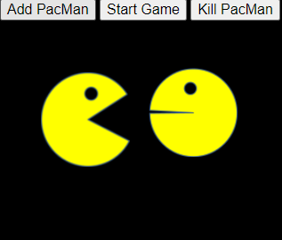
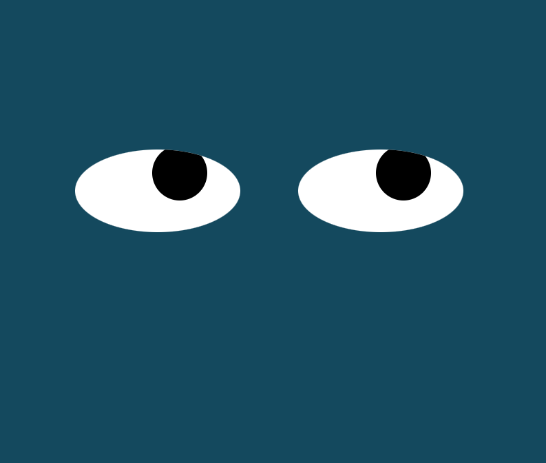

<h1> Projects Page </h1>
<h2> Pacman exercise </h2>

<h3> Description </h3>
  <ul>
    <li> Pacman figures are set to randomly bounce between the edges of the screen. </li>
    <li> Pacman figures are set to randomly show different faces. </li>
    <li> Pacman figures reduce their size after they touch the inner width of the screen and their size go back to normal after they touch the inner height of the screen. </li>

  </ul>
  

<h2> Eyes exercise </h2>
  
<h3> Description </h3>
  <ul>
    <li> The eyes are shaped by managing object properties. </li>
    <li> Eyeballs follow the mouse movement wherever its place within the limits of the screen. </li>
  </ul>
  

<h2> Real Time bus tracker exercise </h2>
  
<h3> Description </h3>
  <ul>
    <li> The bus tracker map will be displayed on screen. </li>
    <li> The bus tracker map has a button to start the marker to move every 15000 ms between MIT and Harvard. </li>
    <li> The bus tracker counts with a personal access token that is free for developers. This token will provide the data that is needed for the marker to move through the stops that are necessary to reach the destination.</li>

  </ul>
